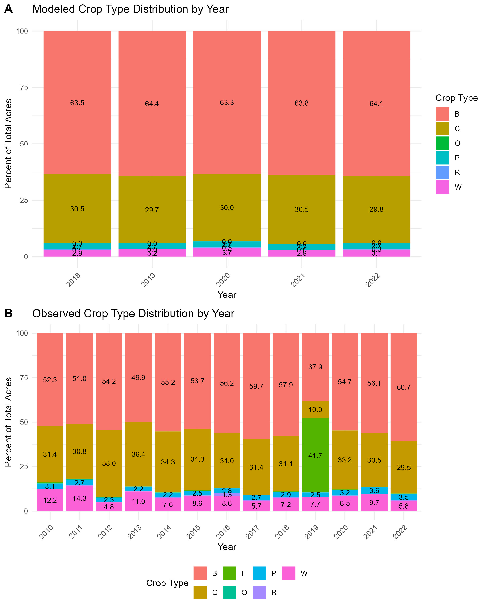
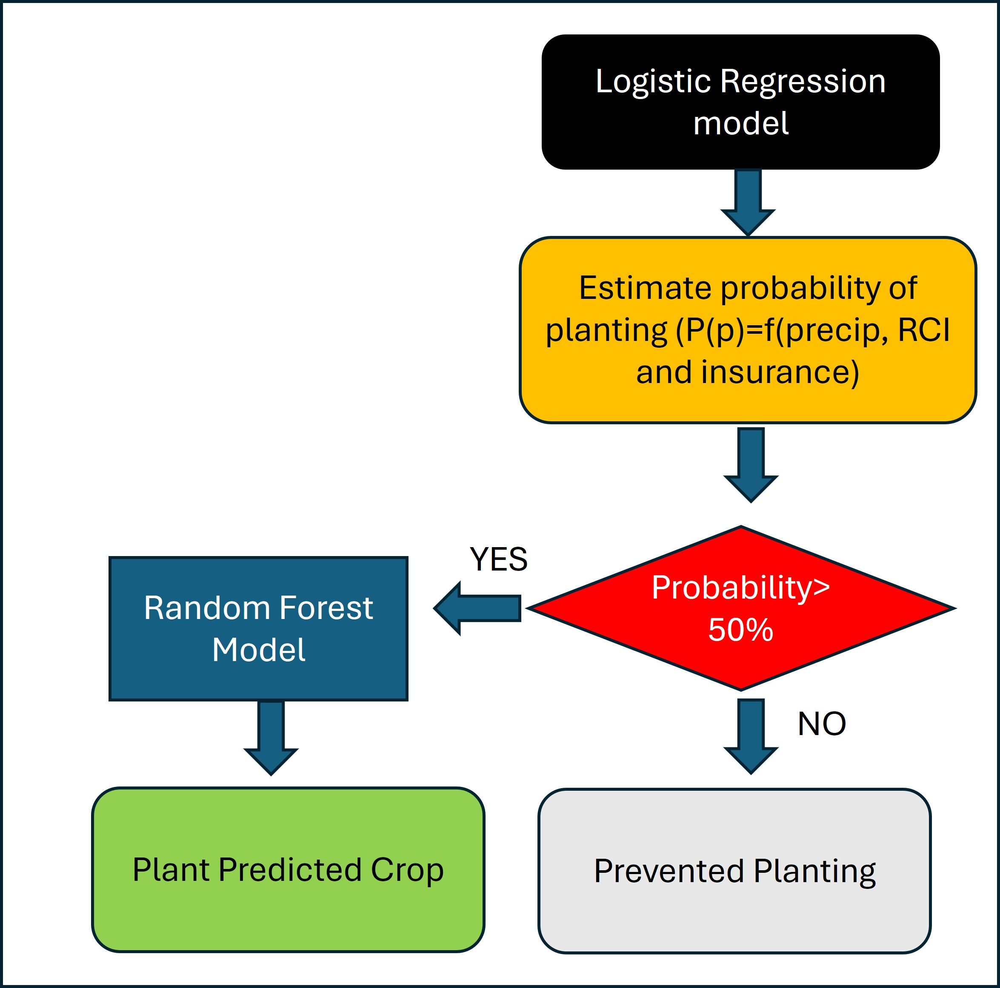
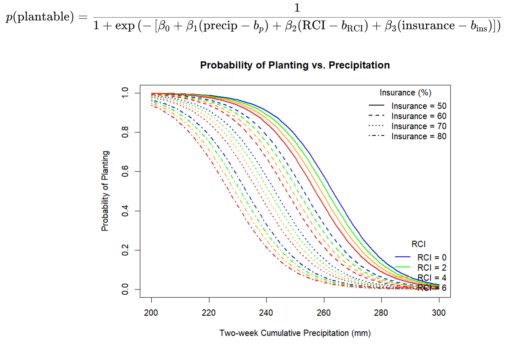

# Crop_ML_ABM

Develop ML-ABM model to simulate the prevented planting.

## Overview

This project develops a machine learning coupled agent-based model (ML-ABM) to simulate crop prevented planting dynamics.

*Conceptual diagram of the ML-ABM for crop failure simulation.*

*ML-based crop choice model*

*Upating the crop choice*

*Use the logistic regress model*

